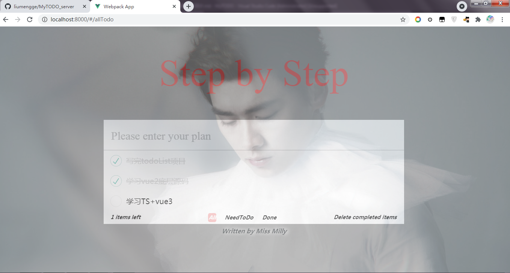

1. 获取所有任务

- 接口说明：获取所有任务(包括未完成和已完成的任务)
- 请求URL：/allTodos
- 请求方式：GET

请求：
```javascript
{
  userId: String
}
```

响应：
```javascript
{
    "err": 0,
    "message": "success",
    "data": [
                {
                    "taskId": "1",
                    "userId": "123",
                    "value": "学习TS+vue3",
                    "status": "0",  // 任务完成状态，1-已完成， 0-未完成
                    "createTime": 1616640881707
                },
                {
                    "taskId": "2",
                    "userId": "123",
                    "value": "完成todo项目",
                    "status": "1",  // 任务完成状态，1-已完成， 0-未完成
                    "createTime": 1616640881707
                }
            ]
}
```

1. 添加一条新的任务

- 请求URL： /todo/addTodoList
- 请求方式：Post

请求：
```javascript
{
    userId: String,
    value: String
}
```

3. 修改任务名称

- 请求URL：/todo/editTodoList
- 请求方式：Post

```javascript
{
    userId: String,
    value: String
}
```

4. 删除一条任务

- 请求URL：/todo/deleteTodoList
- 请求方式: GET

```javascript
{
    userId: String,
    taskId: String
}
```

5. 切换任务完成状态

- 请求URL：/todo/changeTodoStatus
- 请求方式：GET
```javascript
{
    userId：String,
    taskId: String,
    status: String
}
```
