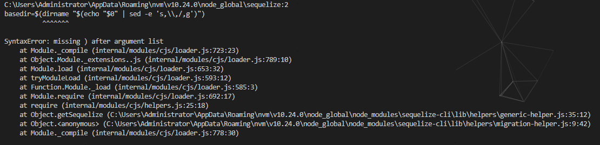
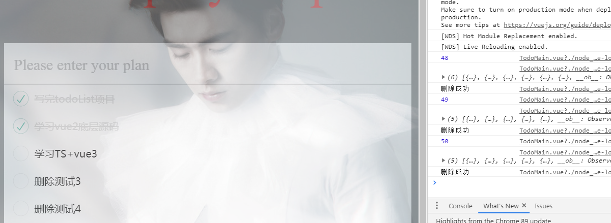
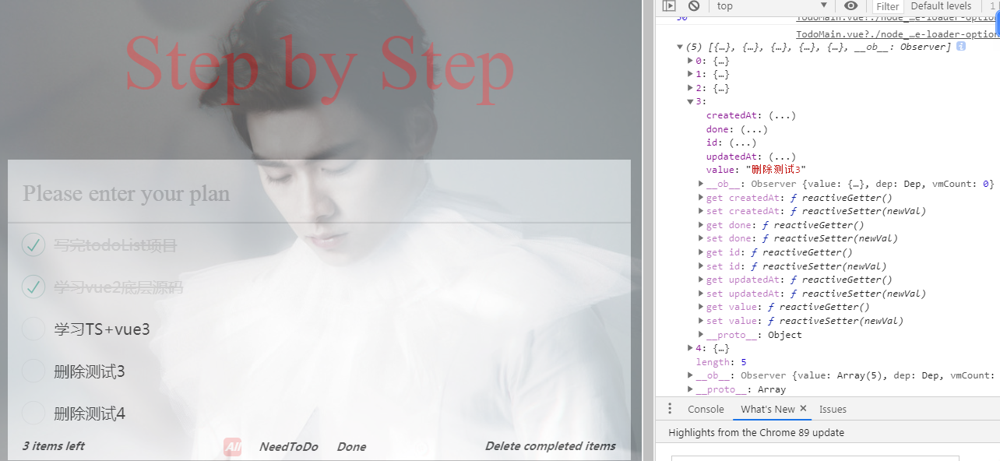
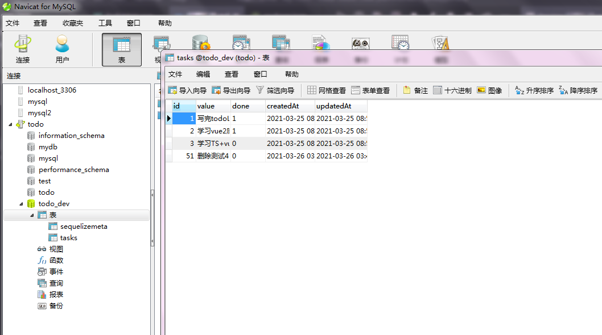
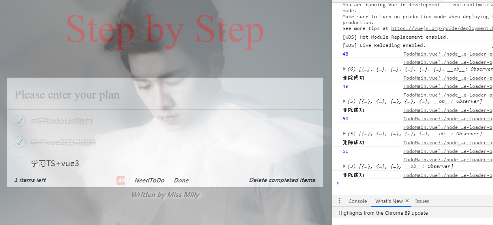

1. 初次配置完webpack后，`npm run build`报错

webapck配置：
```javascript
const path = require('path')

module.exports = {
  entry: path.join(__dirname, 'src/index.js'),
  output: {
    filename: 'bundle.js',
    path: path.join(__dirname, 'dist')
  },
  module: {
    rules: [
      {
        test: /\.vue$/,
        loader: 'vue-loader'
      }
    ]
  },
}
```

报错信息：
```
ERROR in ./src/app.vue
Module Error (from ./node_modules/vue-loader/lib/index.js):
vue-loader was used without the corresponding plugin. Make sure to include VueLoaderPlugin in your webpack config.
 @ ./src/index.js 2:0-27 8:19-22
```
意思是缺少vue-loader对应的插件。

解决方案：在wepback配置文件中引入插件，引入方式如下：
```javascript
const VueLoaderPlugin = require('vue-loader/lib/plugin')

module.exports = {
  // ...
  plugins: [
    new VueLoaderPlugin(),
  ]
}
```


2. webpack配置完`vue-loader`之后报错，无法加载`.vue`文件中`style`部分的内容，报错信息如下：

`app.vue`文件：
```javascript
<template>
  <div class="txt">
    {{ text }}
  </div>
</template>

<script>
export default {
  data() {
    return {
      text: 'milly'
    }
  },
}
</script>

<style>
  .txt {
    color: brown;
  } 
</style>
```

webpack配置文件：
```javascript
const path = require('path')
const VueLoaderPlugin = require('vue-loader/lib/plugin')

module.exports = {
  entry: path.join(__dirname, 'src/index.js'),
  output: {
    filename: 'bundle.js',
    path: path.join(__dirname, 'dist')
  },
  module: {
    rules: [
      {
        test: /\.vue$/,
        loader: 'vue-loader'
      }
    ]
  },
  plugins: [
    new VueLoaderPlugin(),
  ]
}
```

报错信息：
```
ERROR in ./src/app.vue?vue&type=style&index=0&lang=css& (./node_modules/vue-loader/lib??vue-loader-options!./src/app.vue?vue&type=style&index=0&lang=css&) 18:0
Module parse failed: Unexpected token (18:0)
File was processed with these loaders:
 * ./node_modules/vue-loader/lib/index.js
You may need an additional loader to handle the result of these loaders.
|
|
> .txt {
|   color: brown;
| }
 @ ./src/app.vue?vue&type=style&index=0&lang=css& 1:0-123 1:139-142 1:144-264 1:144-264
 @ ./src/app.vue
 @ ./src/index.js
```

解决方案1：在加载.vue文件的时候，使用`style-loader`，npm安装之后在webpack配置文件中使用即可：
```javascript
module: {
  rules: [
    {
      test: /\.vue$/,
      use: [
        'vue-loader',
        'style-loader'
      ]
    }
  ]
},
```
至此，webpack可以成功打包出`dist/bundle.js`文件。


解决方案2：
```javascript
module: {
    rules: [
      {
        test: /\.vue$/,
        use: ['vue-loader']
      },
      {
        test: /\.css$/,
        use: ['css-loader']
      }
    ]
  },
```
原因是在vue里面css并没有指定lang，所以应该给css文件进行单独配置`css-loader`。

2. 开发过程中遇到node版本过高无法运行的问题

- 开发不同项目的时候可能需要不同版本的node环境，更换麻烦，安装node版本管理工具[nvm-windows](https://github.com/coreybutler/nvm-windows/releases)，点击`nvm-setup.zip`下载安装，即：解压zip文件，运行`nvm-setup.exe`安装即可，安装完成之后win10环境下会自动添加nvm和node的环境变量，可以检查一下，如果没有手动添加
- `Win+R` -> cmd打开命令行窗口，输入`nvm -v`出现版本号表示安装成功。
- 如果这时候直接安装不同版本的node，多半是不太行，因为国内有些地址无法下载node和npm，所以需要给它配置一下下载地址：
  - 找到nvm的安装目录，比如默认是安装在`C:\Users\Administrator\AppData\Roaming\nvm`，该目录下有一个配置文件`settings.txt`，打开配置文件在后面添加以下两条指令：
    ```javascript
    node_mirror: https://npm.taobao.org/mirrors/node/
    npm_mirror: https://npm.taobao.org/mirrors/npm/
    ```
  - 添加完成后，就可以使用nvm安装不同版本的node了
- 使用nvm安装node：
  - `nvm list available`：查看可以安装的node版本
  - `nvm install 版本号`：安装对应版本的node
  - `nvm use 版本号`: 使用对应版本号的node
  - `node -v`：查看当前使用的node版本，注意：要执行了`nvm use 版本号`之后才能使用`node`命令
  - 也可以执行`nvm list`查看当前安装的node版本，node前面有星号的表示是当前正在使用的版本
- 全局安装淘宝镜像：`npm i -g cnpm --registry=https://registry.npm.taobao.org`

3. 使用sequelize操作数据库，初始化时报错

win10系统+nvm下的node 12.21.0，全局安装sequelize-cli后，`sequelize init`报错，信息如下：



！！！这个错误第一次见，各种unintsall之后重新install还是不行，看报错信息应该是说路径参数有错误，少一个括号，有一种解释是说这是windows系统不能运行shell脚本导致的，重新检查了安装过程，安装sequelize时会有warning，查了各种博客，建议是说Windows可以忽略这俩个warning，所以安装过程没问题。然后，在同门的相同系统环境下从头到尾安装了一遍，一路非常顺畅？？？初始化成功？过程一样啊？这是为啥呢？ 暂未找到原因！！！

4. 部分引入ElementUI中的Message不起作用

注意，除了`Vue.use(Message)`之外，还需要将Message挂载到Vue的原型上。


5. 删除单项任务时存在bug

- 正常功能：点击单项任务的删除按钮时会发起删除请求，并以参数的形式将需要删除的任务id传给后端，后端操作数据库删除对应id的那条记录，然后查询数据表中剩余的内容返回给客户端，前端将task列表渲染显示出来
- bug现象：多数时候可以正常删除，有时候出现点击当前项删除上一项或者点击当前项删除后一项
- 检测：传入触发删除方法的id正确，后端返回的数据显示有时候没有执行删除操作？？？

比如：新增4个任务项，内容分别为：删除测试1234，在数据库中对应的id分别为48 49 50 51，点击删除测试1和2都成功删除并正常显示，点击删除测试3时出现问题，需要删除的内容对应的id是正确的，但是后端返回的数组表示没有将该id对应的记录删除就直接返回了：





检查数据库会发现，表中的id为50的记录已经被删除掉了：



再点击页面上的删除测试4时会发现，刚才没有被删除掉的3这次和4被一起删除掉了：



- 问题定位：后端接口中操作数据库的执行顺序存在问题，删除数据库中id对应的记录之前先查询了数据库并返回给客户端了

后端接口代码：
```javascript
router.delete("/:id", async function (req, res, next) {
  let task = await models.Task.findByPk(req.params.id);
  task.destroy(req.body)
  let tasks = await models.Task.findAll(); 
  res.json({ 
    msg: "删除成功",
    tasks: tasks
  });
});
```
改为：
```javascript
router.delete("/:id", async function (req, res, next) {
  let task = await models.Task.findByPk(req.params.id);
  await task.destroy(req.body)
  let tasks = await models.Task.findAll(); 
  res.json({ 
    msg: "删除成功",
    tasks: tasks
  });
});
```
需要保证将数据库中对应id的那条记录删除掉再去查询数据表中剩余的数据。

6. 注意：在子组件中不能直接修改从父组件中接收到的数据 --- 完善单项任务的状态切换功能

- 之前的做法：在子组件TodoList.vue中的复选框上v-model绑定了从父组件中接收到的todoList中的done属性，如果该项任务的done为1时就对应true，选中该复选框，这种操作相当于直接操作了父组件中的变量。现在项目小，目前没发现有不合适的地方，一旦其他组件也接收父组件传递的todoList也直接修改的话就会造成父组件中变量混乱。

- 修改与完善：在子组件中单独设置一个修改的变量，如果需要传给父组件再通过$emit传递出去即可。
